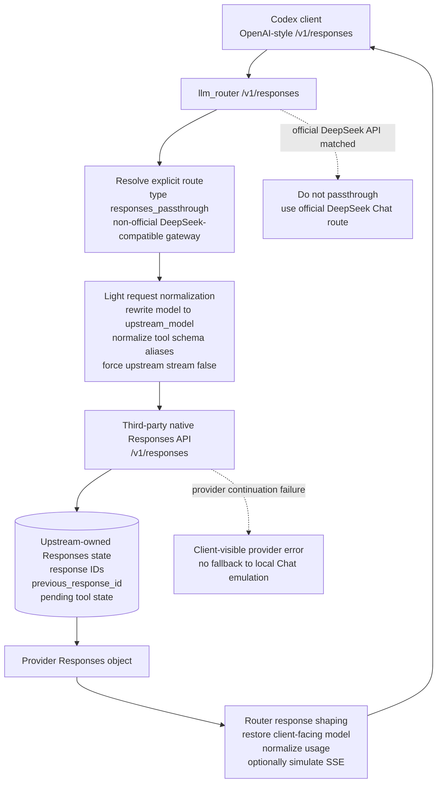

# LLM Router

`llm-router` is a local router for adapting Codex traffic to non-OpenAI model
providers. The project is currently centered on these route families:

- DeepSeek official API through its Chat-compatible API surface.
- Explicit third-party Responses passthrough routes for providers that expose
  their own `/v1/responses` state machine.
- MiroThinker models that prefer MCP/XML tool calls.

Codex still executes local tools. The router only adapts requests and responses
between Codex and the upstream model provider.

## Supported Routes

The default route config is in [`router.toml`](router.toml).

| Model pattern | Type | Upstream | Notes |
| --- | --- | --- | --- |
| `deepseek-*` | `responses_chat` | `deepseek` | Main supported route. Router keeps Responses state and adapts to upstream Chat `function` tools. |
| `mirothinker-*` | `mcp_first` | `mirothinker` | MCP-first route. Native tools are converted to an MCP XML prompt. |

Third-party providers that expose a compatible native `/v1/responses` endpoint
can be configured explicitly with `type = "responses_passthrough"`. Official
DeepSeek at `https://api.deepseek.com` should stay on the `responses_chat`
route because this router targets DeepSeek's Chat API there.

```toml
[upstream.deepseek]
base_url = "https://api.deepseek.com"
api_key_env = "DEEPSEEK_API_KEY"

[upstream.deepseek_gateway]
base_url = "https://zapi.aicc0.com/v1"
api_key_env = "DEEPSEEK_GATEWAY_API_KEY"

[[routes]]
pattern = "deepseek-v4-pro-gateway"
type = "responses_passthrough"
upstream = "deepseek_gateway"
upstream_model = "deepseek-v4-pro"

[[routes]]
pattern = "deepseek-*"
type = "responses_chat"
upstream = "deepseek"
```

Route order matters: first match wins. Put specific passthrough model aliases
before broad `deepseek-*` Chat routes.

## Request Flow

The two important `/v1/responses` paths differ by who owns Responses state.
Official DeepSeek uses the router-owned Chat adapter path. A third-party
Responses-compatible gateway uses the explicit `responses_passthrough` path,
where the upstream owns response IDs and continuation state.

### Official DeepSeek Chat Route


### Third-Party DeepSeek Responses Passthrough



## Install

```bash
uv sync
```

## Configure

Set the upstream keys used by `router.toml`:

```bash
export DEEPSEEK_API_KEY="sk-..."
# Optional, only if you enable a responses_passthrough gateway route:
export DEEPSEEK_GATEWAY_API_KEY="sk-..."
```

The repo includes these Codex helper files:

- [`codex.config.example.toml`](codex.config.example.toml): example Codex config
  with the `llm_router` provider/profile.
- [`llm_router.json`](llm_router.json): static model catalog for the
  `llm_router` profile.

Install the static catalog:

```bash
mkdir -p ~/.codex
cp llm_router.json ~/.codex/llm_router.json
```

Then merge the relevant provider/profile settings from
[`codex.config.example.toml`](codex.config.example.toml) into
`~/.codex/config.toml`.

The intended Codex usage is:

| Command | Provider | Model catalog | Default model |
| --- | --- | --- | --- |
| `codex -p llm_router` | Local `llm_router` provider | `~/.codex/llm_router.json` | `deepseek-v4-pro` |

`env_key` in the Codex example is only a Codex-side placeholder for now. Real
upstream keys are read by `llm-router` according to [`router.toml`](router.toml),
for example `DEEPSEEK_API_KEY` for DeepSeek.

## Run

Start the router:

```bash
uv run llm-router serve
```

With debug logs:

```bash
uv run llm-router serve --debug
```

Debug logs are written to `llm_router.jsonl` as JSONL.

Launch Codex through the router profile:

```bash
codex -p llm_router
```

## DeepSeek Adapter

DeepSeek support lives in `llm_router.deepseek`.

The adapter currently handles:

- Responses items to Chat messages.
- `developer` role to `system` role.
- Codex `function` and `custom` tools as DeepSeek-compatible Chat `function`
  tools.
- DeepSeek-route filtering for unsupported hosted Responses tools such as
  `web_search`.
- DeepSeek Chat `tool_calls` back to Codex Responses output items.
- DeepSeek `reasoning_content` round trip when available.
- Tool-call ordering repairs when Codex inserts side-channel messages between a
  tool call and its tool output.
- DeepSeek-specific payload filtering so Responses metadata such as
  `client_metadata` is not sent to DeepSeek.

## MiroThinker Adapter

MiroThinker support lives in `llm_router.mirothinker`.

The adapter currently handles:

- MCP XML prompt injection from the Codex tool list.
- Parsing `<use_mcp_tool>` output from content or reasoning text.
- Returning parsed MCP calls as Codex tool calls.
- Retry feedback when emitted MCP XML is incomplete.

Only MiroThinker is intended to be MCP-first.

## Sessions

Responses sessions are stored at:

```text
./.llm-router/sessions.json
```

Set `LLM_ROUTER_SESSION_STORE=/path/to/sessions.json` to use an explicit
session file.

Check session state:

```bash
uv run llm-router status
```

Clear stored sessions:

```bash
uv run llm-router clear
```

Skip confirmation:

```bash
uv run llm-router clear -f
```

Clearing sessions is useful after adapter changes or when a conversation contains
old incompatible tool-call history.

## Streaming Status

Current `/v1/responses` streaming is simulated SSE over a non-streaming upstream
request. This preserves the router-owned state-machine guarantee:
commit session state only after upstream success (`commit-after-success`).

TODO: add real upstream streaming for `/v1/responses` while preserving the same
`commit-after-success` constraint. Future enhancement can add an optional
failed-turn snapshot/draft buffer (non-committed) for better UX when streams
fail mid-turn.

## Development

Developer and agent-facing guidance is provided in [`AGENTS.md`](AGENTS.md) and
[`CLAUDE.md`](CLAUDE.md).

The main `/v1/responses` regressions are split by behavior under
[`tests/responses`](tests/responses). [`tests/test_server_responses.py`](tests/test_server_responses.py)
is an aggregate entrypoint kept for the focused command used by the docs and
agent instructions.

Run tests:

```bash
uv run python -m pytest -q
```

Run the focused Responses suite:

```bash
uv run python -m pytest tests/test_server_responses.py -q
```

Run lint:

```bash
uv run ruff check .
```
