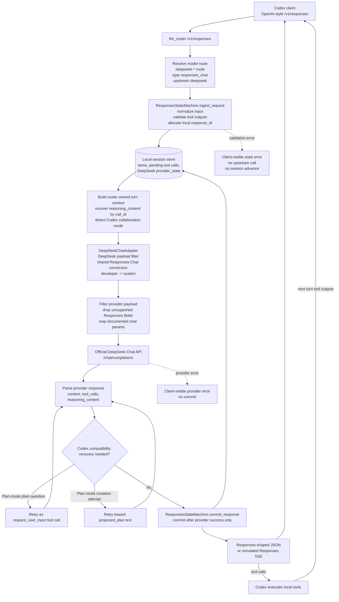
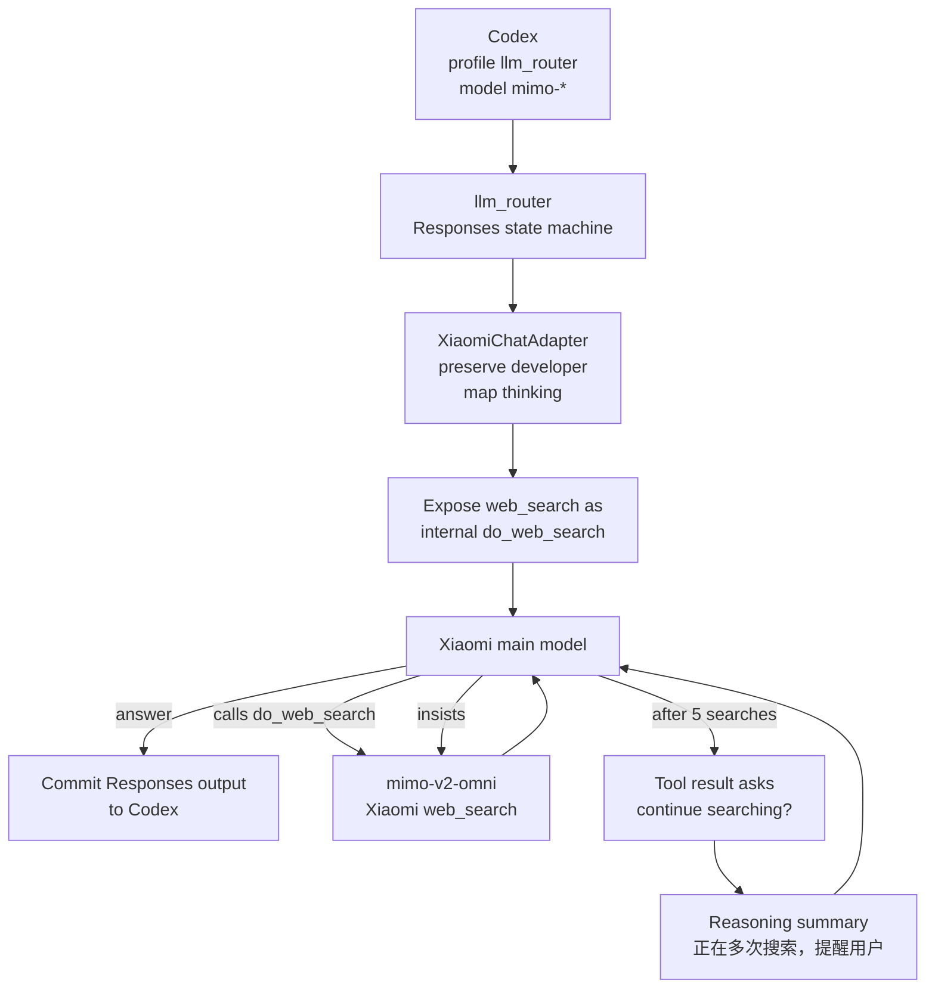
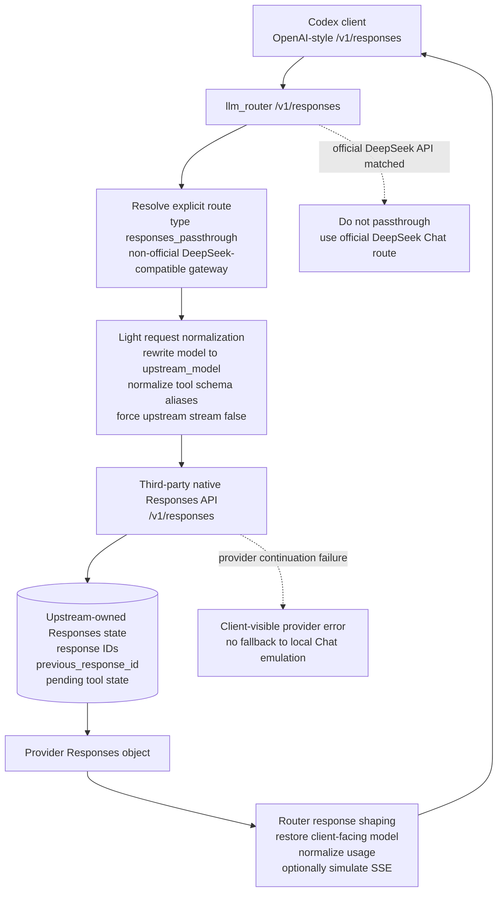

# LLM Router

`llm-router` is a local router for adapting Codex traffic to non-OpenAI model
providers. The project is currently centered on these route families:

- DeepSeek official API through its Chat-compatible API surface.
- Xiaomi MiMo official API through its Chat-compatible API surface.
- Explicit third-party Responses passthrough routes for providers that expose
  their own `/v1/responses` state machine.
- MiroThinker models that prefer MCP/XML tool calls.

Codex still executes local tools. The router only adapts requests and responses
between Codex and the upstream model provider.

## Supported Routes

The default route config is in [`router.toml`](router.toml).

| Model pattern | Type | Upstream | Notes |
| --- | --- | --- | --- |
| `deepseek-*` | `responses_chat` | `deepseek` | Main supported route. Router keeps Responses state and adapts to upstream Chat `function` tools. |
| `mimo-*` | `responses_chat` | `xiaomi` | Xiaomi MiMo official Chat API route. Router keeps Responses state, preserves `developer`, and adapts thinking/tool replay. |
| `mirothinker-*` | `mcp_first` | `mirothinker` | MCP-first route. Native tools are converted to an MCP XML prompt. |

Third-party providers that expose a compatible native `/v1/responses` endpoint
can be configured explicitly with `type = "responses_passthrough"`. Official
DeepSeek at `https://api.deepseek.com` should stay on the `responses_chat`
route because this router targets DeepSeek's Chat API there.

```toml
[upstream.deepseek]
base_url = "https://api.deepseek.com"
api_key_env = "DEEPSEEK_API_KEY"

[upstream.deepseek_gateway]
base_url = "https://zapi.aicc0.com/v1"
api_key_env = "DEEPSEEK_GATEWAY_API_KEY"

[[routes]]
pattern = "deepseek-v4-pro-gateway"
type = "responses_passthrough"
upstream = "deepseek_gateway"
upstream_model = "deepseek-v4-pro"

[[routes]]
pattern = "deepseek-*"
type = "responses_chat"
upstream = "deepseek"
```

Route order matters: first match wins. Put specific passthrough model aliases
before broad `deepseek-*` Chat routes.

## Request Flow

The two important `/v1/responses` paths differ by who owns Responses state.
Official DeepSeek uses the router-owned Chat adapter path. A third-party
Responses-compatible gateway uses the explicit `responses_passthrough` path,
where the upstream owns response IDs and continuation state.

### Official DeepSeek Chat Route



### Xiaomi MiMo Chat Route



### Third-Party DeepSeek Responses Passthrough



## Install

```bash
uv sync
```

## Configure

Set the upstream keys used by `router.toml`:

```bash
export DEEPSEEK_API_KEY="sk-..."
export MIMO_API_KEY="sk-..."
# Optional, only if you enable a responses_passthrough gateway route:
export DEEPSEEK_GATEWAY_API_KEY="sk-..."
```

Xiaomi MiMo supports both the ordinary official Chat API and Token Plan
clusters. The default `mimo-*` route uses one `xiaomi` upstream pointed at the
China Token Plan base URL: `https://token-plan-cn.xiaomimimo.com/v1`. Other
official base URLs are kept as comments in [`router.toml`](router.toml) so the
single `xiaomi` upstream can be edited directly when a different cluster should
own MiMo traffic.

The repo includes these Codex helper files:

- [`codex.config.example.toml`](codex.config.example.toml): example Codex config
  with the `llm_router` provider/profile.
- [`llm_router.json`](llm_router.json): static model catalog for the
  `llm_router` profile.

Install the static catalog:

```bash
mkdir -p ~/.codex
cp llm_router.json ~/.codex/llm_router.json
```

Then merge the relevant provider/profile settings from
[`codex.config.example.toml`](codex.config.example.toml) into
`~/.codex/config.toml`.

The intended Codex usage is one `llm_router` profile:

| Command | Provider | Model catalog | Default model |
| --- | --- | --- | --- |
| `codex -p llm_router` | Local `llm_router` provider | `~/.codex/llm_router.json` | `deepseek-v4-pro` |

MiMo is not a separate Codex profile. Use the same `llm_router` profile and
select a `mimo-*` model from the `llm_router` model catalog; the router then
matches that model to the Xiaomi route in [`router.toml`](router.toml).

`env_key` in the Codex example is only a Codex-side placeholder for now. Real
upstream keys are read by `llm-router` according to [`router.toml`](router.toml),
for example `DEEPSEEK_API_KEY` for DeepSeek.

## Run

Start the router:

```bash
uv run llm-router serve
```

With debug logs:

```bash
uv run llm-router serve --debug
```

Debug logs are written to `llm_router.jsonl` as JSONL.

Launch Codex through the router profile:

```bash
codex -p llm_router
```

## DeepSeek Adapter

DeepSeek support lives in `llm_router.deepseek`.

The adapter currently handles:

- Responses items to Chat messages.
- `developer` role to `system` role.
- Codex `function` and `custom` tools as DeepSeek-compatible Chat `function`
  tools.
- DeepSeek-route filtering for unsupported hosted Responses tools such as
  `web_search`.
- DeepSeek Chat `tool_calls` back to Codex Responses output items.
- DeepSeek `reasoning_content` round trip when available, with synthetic
  display summaries and raw reasoning preserved in Responses `content`.
- Tool-call ordering repairs when Codex inserts side-channel messages between a
  tool call and its tool output.
- DeepSeek-specific payload filtering so Responses metadata such as
  `client_metadata` is not sent to DeepSeek.

## Xiaomi Adapter

Xiaomi MiMo support lives in `llm_router.xiaomi`.

The adapter currently handles:

- Xiaomi official Chat request filtering for documented text, tool, and
  thinking parameters.
- Mapping Codex `reasoning` / `reasoning_effort` to Xiaomi
  `thinking.type`, while preserving explicit `thinking` when provided.
- Preserving `developer` messages because Xiaomi documents that role directly.
- Xiaomi image input by converting Responses `input_image` content items to
  Chat `image_url` parts.
- Structured image content in tool outputs for Xiaomi multimodal follow-up
  turns.
- Codex `function`, `namespace`, and `custom` tools as Chat `function` tools.
- Xiaomi-only router built-in `web_search`: Codex hosted search is exposed to
  Xiaomi as an internal `do_web_search` function. Only if the model calls it
  does the router run a separate `mimo-v2-omni` search subrequest and feed the
  result back as tool output.
- Repeated Xiaomi internal search guardrails: after five consecutive
  `do_web_search` rounds, the router returns an internal tool result asking the
  main model whether it still needs to continue. If the model calls
  `do_web_search` again, the router resumes searching and starts a new
  five-round window. The Codex-facing response gets a reasoning summary
  `正在多次搜索，提醒用户` when this guardrail is triggered.
- Xiaomi `reasoning_content` conversion into Codex Responses reasoning items,
  with synthetic display summaries and raw reasoning preserved in Responses
  `content`.
- Xiaomi thinking/tool replay state under `provider_state["xiaomi"]`, isolated
  from DeepSeek provider state.
- Xiaomi web-search `annotations` on final text responses for clients that keep
  provider citation metadata.

The adapter targets Codex text, image, tool, and web-search workflows. Xiaomi
TTS/audio and video understanding are not implemented as Codex-facing semantics
yet.

Xiaomi `web_search` is provider-specific and must not be generalized to other
providers. The main Xiaomi model request keeps its normal Codex-derived thinking
setting and any remaining function tools. The search subrequest uses
`thinking.type = "disabled"` for cheaper retrieval. If the search subrequest
fails, the router logs `XIAOMI_BUILTIN_WEB_SEARCH_FAILED`, returns JSON `null`
as the internal tool output, and lets the main model continue. If the model keeps
requesting search repeatedly, the router does not expose an unfinished
`do_web_search` call to Codex; it injects an internal tool result that asks the
model to either call `do_web_search` again or answer from the accumulated search
context.

The static catalog includes `mimo-v2.5-pro`, `mimo-v2.5`, `mimo-v2-pro`,
`mimo-v2-omni`, and `mimo-v2-flash`. Image input is enabled only for the MiMo
models with documented or maintainer-confirmed image support.

Current Xiaomi regressions cover the meaningful provider boundary rather than
only helper shape:

- adapter conversion in [`tests/test_xiaomi_adapter.py`](tests/test_xiaomi_adapter.py)
  for request filtering, `thinking` mapping, `developer` role preservation,
  image parts, structured tool-output images, Xiaomi web-search conversion,
  annotations, and reasoning replay.
- `/v1/responses` behavior in
  [`tests/responses/validation_and_tools.py`](tests/responses/validation_and_tools.py)
  for multimodal request forwarding, Xiaomi-only `do_web_search` exposure,
  main-request `thinking` preservation, internal search continuation,
  null-on-search-failure behavior, repeated-search questioning and continuation,
  reasoning-summary notification for repeated search, and function-tool
  preservation after hosted search is replaced.
- provider sidecar persistence in
  [`tests/responses/state_and_deepseek.py`](tests/responses/state_and_deepseek.py)
  to keep Xiaomi `reasoning_content` replay isolated from DeepSeek state.
- catalog and route regressions in [`tests/test_model_catalog.py`](tests/test_model_catalog.py)
  and [`tests/test_config.py`](tests/test_config.py).

Live Xiaomi smoke tests are opt-in because they consume provider quota:

```bash
LLM_ROUTER_LIVE_XIAOMI=1 MIMO_API_KEY=... uv run python -m pytest tests/live/test_xiaomi_api.py -q
```

Use `MIMO_BASE_URL` to point the live smoke tests at a Token Plan cluster, and
`MIMO_LIVE_MODEL` to test a specific MiMo model.

## MiroThinker Adapter

MiroThinker support lives in `llm_router.mirothinker`.

The adapter currently handles:

- MCP XML prompt injection from the Codex tool list.
- Parsing `<use_mcp_tool>` output from content or reasoning text.
- Returning parsed MCP calls as Codex tool calls.
- Retry feedback when emitted MCP XML is incomplete.

Only MiroThinker is intended to be MCP-first.

## Sessions

Responses sessions are stored at:

```text
./.llm-router/sessions.json
```

Set `LLM_ROUTER_SESSION_STORE=/path/to/sessions.json` to use an explicit
session file.

Check session state:

```bash
uv run llm-router status
```

Clear stored sessions:

```bash
uv run llm-router clear
```

Skip confirmation:

```bash
uv run llm-router clear -f
```

Clearing sessions is useful after adapter changes or when a conversation contains
old incompatible tool-call history.

## Streaming Status

Current `/v1/responses` on router-owned `responses_chat` routes uses real
upstream Chat streaming (DeepSeek official path) and emits Responses SSE
incrementally for:

- reasoning deltas
- assistant text deltas
- tool-call argument/input deltas (function + custom)

The router still preserves `commit-after-success`: session state is committed
only after upstream success.

Current explicit constraint:

- mixed text+tool-call streaming in the same turn is rejected by default
- `LLM_ROUTER_EXPERIMENTAL_MIXED_STREAM=1` allows the router to process this
  mixed stream path while preserving commit-after-success

TODO:

- keep default strict behavior until Codex e2e proves stable mixed-stream
  delta routing
- track Codex support for `response.function_call_arguments.delta`; current
  Codex builds execute function tools from final `response.output_item.done`

## Development

Developer and agent-facing guidance is provided in [`AGENTS.md`](AGENTS.md) and
[`CLAUDE.md`](CLAUDE.md).

The main `/v1/responses` regressions are split by behavior under
[`tests/responses`](tests/responses). [`tests/test_server_responses.py`](tests/test_server_responses.py)
is an aggregate entrypoint kept for the focused command used by the docs and
agent instructions.

Run tests:

```bash
uv run python -m pytest -q
```

Run the focused Responses suite:

```bash
uv run python -m pytest tests/test_server_responses.py -q
```

Run focused Xiaomi regressions:

```bash
uv run python -m pytest tests/test_xiaomi_adapter.py tests/test_model_catalog.py tests/responses/validation_and_tools.py::test_responses_xiaomi_exposes_do_web_search_without_eager_search tests/responses/validation_and_tools.py::test_responses_xiaomi_runs_do_web_search_and_continues_main_request tests/responses/validation_and_tools.py::test_responses_xiaomi_do_web_search_failure_returns_null_tool_output tests/responses/validation_and_tools.py::test_responses_xiaomi_questions_model_after_five_searches_then_stops tests/responses/validation_and_tools.py::test_responses_xiaomi_continues_when_model_insists_after_search_question tests/responses/validation_and_tools.py::test_responses_xiaomi_builtin_web_search_keeps_function_tools_on_main_request tests/responses/state_and_deepseek.py::test_responses_xiaomi_persists_provider_reasoning_state tests/responses/state_and_deepseek.py::test_responses_xiaomi_replays_provider_reasoning_state -q
```

Run lint:

```bash
uv run ruff check .
```
